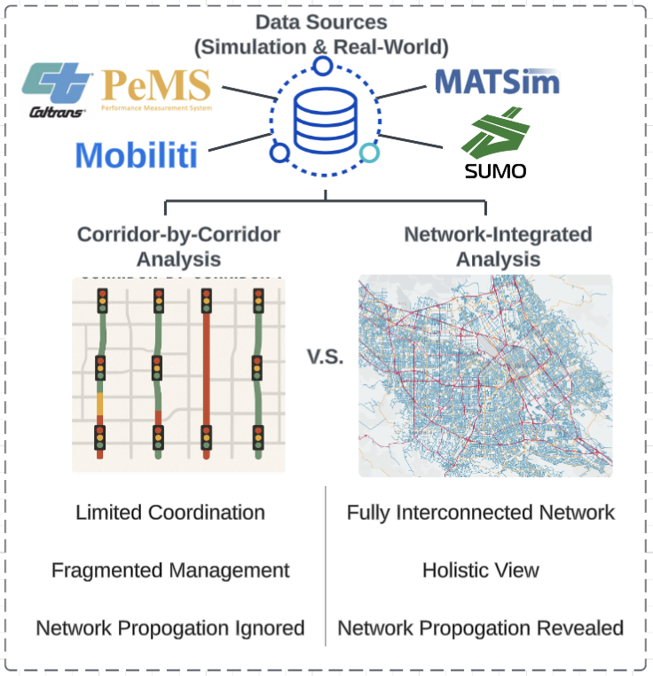
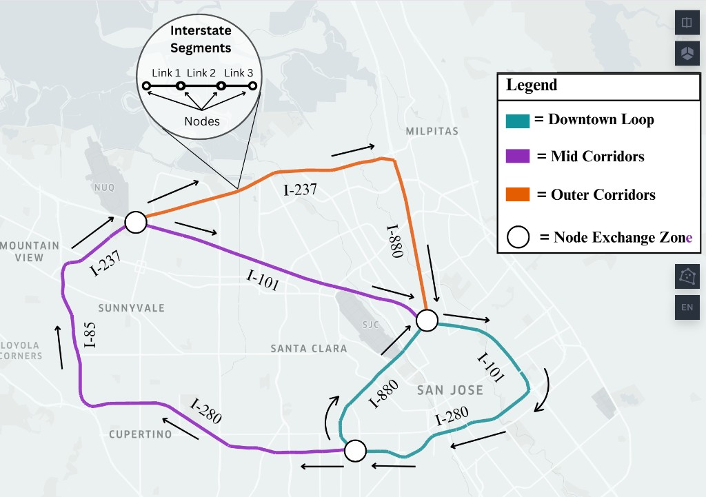
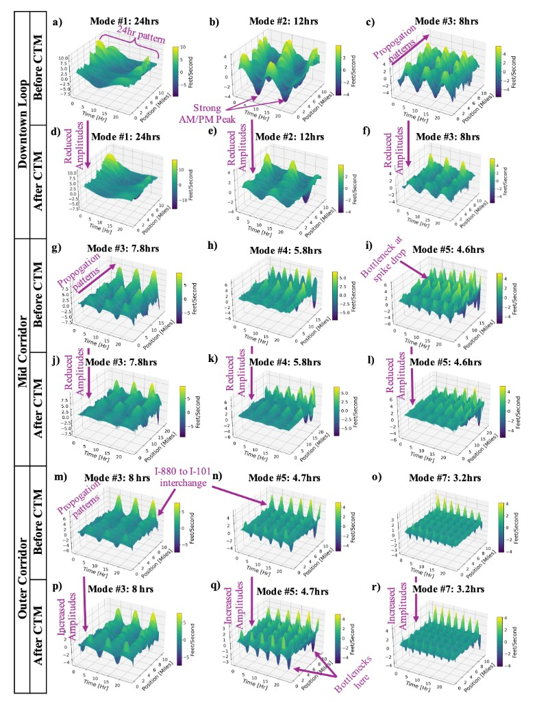

# LinkstoNetworksKMD-CTM

**Physics-consistent, data-driven traffic-speed forecasting on a road network —
Koopman/Hankel-DMD paired with a Cell Transmission Model (CTM) correction step.**

## Motivation

Purely data-driven forecasters (Koopman/DMD, and neural models alike) are good
at capturing the dominant spatiotemporal patterns in traffic, but nothing stops
their predictions from drifting into physically impossible states — speeds that
violate flow conservation at junctions, ignore link jam-density limits, or let
congestion appear and vanish without propagating along the network.

This project keeps the strengths of a linear, interpretable Koopman model while
constraining it with traffic-flow physics. After every forecast step, a
**Cell Transmission Model (CTM)** correction re-imposes conservation and
congestion-propagation behavior on the road graph, so short-horizon speed
forecasts stay both accurate **and** physically consistent.

## Study area & data

The pipeline runs on the **San Jose, CA** freeway network, using traffic data
drawn from both real-world and simulation sources — **Caltrans PeMS**,
**Mobiliti**, **MATSim**, and **SUMO**. Rather than studying arterials in
isolation, the network is treated as a fully interconnected system, so that
congestion propagation *between* corridors is preserved instead of being lost to
fragmented, corridor-by-corridor management.



Analysis is organized around three freeway **loops**, joined at **node exchange
zones** where flow transfers between them:

- **Downtown Loop** — the San Jose downtown loop formed by **I-101**, **I-280**,
  and **I-880**.
- **Mid Corridor** — **I-237**, **I-101**, **I-85**, and **I-280** through
  Mountain View, Sunnyvale, Santa Clara, and Cupertino.
- **Outer Corridor** — **I-237** and **I-880** out toward Milpitas, including the
  **I-880 → I-101** interchange.



## Method

Each corridor is an ordered set of freeway links with geometry and length.

**1. Data preparation.** Link geometries are built from node coordinates, link
IDs are aligned between the speed dataset and the network layout, corridors are
filtered out of the full network, and missing/NaN entries are cleaned.

**2. Koopman mode decomposition (Hankel-DMD).** Speed snapshots over each
corridor are stacked into a time-delay (Hankel) embedding, from which the
Koopman operator is approximated via SVD. This yields spatiotemporal **modes**,
their **eigenvalues**, and oscillation **periods**, and an eigenvalue-stability
check against the unit circle (modes are visualized as 3D surfaces over
position × time).

**3. Cell Transmission Model (CTM).** A node-based CTM propagates congestion
upstream/downstream using link-specific jam density and an exponential
distance-decay, enforcing physically admissible speeds across junctions.

**4. Iterative Koopman + CTM forecasting.** For each step, the model builds a
Koopman operator from a rolling window of recent snapshots (a 12-hour /
48-snapshot window at 15-minute resolution), predicts one step ahead, then
applies the CTM correction before rolling the window forward. This "predict →
correct → advance" loop is what keeps multi-step forecasts stable.

**5. Accuracy analysis.** Forecasts are compared to observations with
**TMAE** (time-mean absolute error), **SMAE** (space-mean absolute error), and
overall **MAE/RMSE** (in mph), plus per-corridor histograms of observed vs.
forecasted speeds.

## Koopman modes & CTM effect



*KMD results extracted from traffic data across the network: Downtown (a–f), Mid
Corridor (g–l), and Outer Corridor (m–r). The modes reveal distinct
spatiotemporal congestion patterns, including strong AM and PM peaks (panels
a–c), indicative of commuter-driven congestion cycles. Specific freeway
interchanges, notably the I-880 to I-101 merge, exhibit clear bottlenecks
characterized by pronounced spikes or amplitude reductions (panels m, n, o).
Applying CTM visibly reduces mode amplitudes for the Downtown loop and Mid
Corridor, enforcing realistic traffic dynamics and highlighting critical
congestion points (panels d–f and j–l). Interestingly, for the Outer Corridor
(panels p–r), amplitude increases are observed following CTM integration,
highlighting previously underestimated congestion bottlenecks and congestion
dynamics. Overall, these modes illustrate the nuanced propagation of congestion
waves across a networked freeway system.*

## Demo

`video/TrafficSpeedDynamics.mp4` shows the forecasted network speed dynamics
evolving over time across the corridors.

## Data & privacy

> Traffic data is drawn from a mix of real-world and simulation sources
> (Caltrans PeMS, Mobiliti, MATSim, SUMO). Actual speed/flow/density values and
> link IDs in this repository are replaced with **dummy/masked data** to respect
> Mobiliti's data-privacy terms. The code and pipeline are the contribution here;
> plug in real feeds to reproduce quantitative results.

## Repository structure

| File | Purpose |
| --- | --- |
| `data_preparation.py` | Merge node geometry, filter corridor data, align link IDs, clean NaNs. |
| `ctm.py` | Cell Transmission Model — `apply_ctm`, plus `propagate_upstream` / `propagate_downstream`. |
| `Koopman_H_DMD.py` | Hankel-DMD (`H_DMD`), Koopman mode extraction/visualization, eigenvalue-stability check. |
| `koopman_forecast.py` | Iterative Koopman+CTM rolling-window forecasting and accuracy analysis (TMAE/SMAE/MAE/RMSE). |
| `main.py` | End-to-end driver: load data → filter corridors → CTM → Koopman modes → iterative forecast. |
| `data/` | Example network + time-series files (dummy/masked values). |
| `video/` | Traffic speed-dynamics animation. |
| `figures/` | Study-area map, data-source diagram, and Koopman-mode figures. |

## Running it

```bash
pip install numpy pandas geopandas shapely matplotlib openpyxl
python main.py
```

`main.py` loads the network and corridor definitions, runs corridor filtering
and the CTM, extracts Koopman modes, then performs the iterative Koopman+CTM
forecast and writes results/plots. Because the shipped data is masked, the
numbers are illustrative — swap in real speed/flow/density feeds (matching the
expected `link_id`-indexed CSV format) to reproduce quantitative accuracy.
